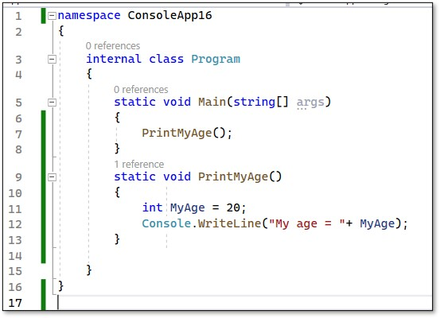

# Method

Methods เป็น block ของการประมวลผล เป็นสมาชิกของ Type
สามารถเรียกให้ทำงานได้จากส่วนอื่นของ Type, ส่วนอื่นของ program หรือแม้กระทั่งจาก program อื่นๆ

ชื่อของ method มักจะได้มาจากพฤติกรรมของวัตถุในโลกจริง (real world object)
ในบางครั้ง method ที่ถูกใช้เพียงครั้งเดียว จะถูกสร้างขึ้นเป็น block ณ ที่จุดเรียกใช้ และไม่ได้ตั้งชื่อให้ method นั้น เรียกว่า anonymous method 


### ตัวอย่างการเรียกใช้ method

การเรียกให้ method ทำงาน เรียกว่า calling หรือ invocation
เมื่อถูกเรียก method จะทำงานตั้งแต่เริ่ม block จนจบ block

Block ของ method ถูกกำหนดด้วยเครื่องหมาย { และ }

Method บางตัว จะส่งค่าที่ได้จากการทำงานกลับไปยังจุดที่ถูกเรียก (return)

ในภาษา C# เราสามารถส่งค่ากลับผ่านทาง input parameter ได้เช่นกัน 


### ตัวอย่างการประกาศ method

```cs
namespace SomeNamespace
{
    class SomeClass
    {
        returnType methodName() 
        {
             // method body
        }
    }
}
```

## การสร้าง Method ที่ไม่มีการ return ค่า



จากรูป

บรรทัดที่ 9 ~ 13 เป็นการสร้าง method ที่ชื่อ PrintMyAge() ซึ่งทำหน้าที่แสดงข้อความที่ประกอบด้วย string และ int (ที่ถูกแปลงเป็น string ให้โดยอัตโนมัติ) ออกทางหน้าจอ

บรรทัดที่ 7 เป็นการเรียกใช้งาน  (calling หรือ invoking) เมธอดที่ชื่อ PrintMyAge ซึ่งมีการทำงานดังที่ระบุไว้ในเมธอดนั่นเอง

## เมธอดสำหรับพิมพ์ชื่อและรหัสนักศึกษา

ให้แก้ไขโปรแกรมนีั้ โดยการระบุชื่อนักศึกษาลงใน <1. Enter your name> และรหัสนักศึกษาลงใน <2. Enter your ID > แล้วรันโปรแกรม จับภาพหน้าจอเตรียมไว้ส่งงาน

```cs
namespace ConsoleApp16
{
    internal class Program
    {
        static void Main(string[] args)
        {
            PrintStudentInfo();
        }
        static void PrintStudentInfo()
        {
            string  StuName = "<1. Enter your name>" ;
            int StuID = <2. Enter your ID >;
            Console.WriteLine("My name = "+ Stuname);
            Console.WriteLine("My ID = "+ StuID);
        }

    }
}
```

## ข้อควรระวังในการใข้งาน method "Console.WriteLine"

เขียนโปรแกรมต่อไปนี้แล้วตอบคำถามด้านล่างก่อนรันโปรแกรม

```cs
namespace ConsoleApp16
{
    internal class Program
    {
        static void Main(string[] args)
        {
            PrintSum();
        }
        static void PrintSum()
        {
            int a = 5;
            int b = 10;
            Console.WriteLine("Sum of a and b = " + a + b);
        }
    }
}
```

```cs
คำถาม: นักศึกษาคิดว่าโปรแกรมนี้จะแสดงผลออกมาอย่างไร

คำตอบ: โค้ดที่แสดงผลผลรวมของเลข 5 และ 10 และ PrintSum() เป็นฟังก์ชันที่ทำการคำนวณ
```

รันโปรแกรมลแวบันทึกผลการทำลอง

```cs
ผลที่ได้จากการันโปรแกรม เหมือนกับที่คาดหวังไว้หรือไม่ อธิบาย

คำตอบ: จะแสดงผลผิดพลาดเนื่องจากการเชื่อมข้อความแบบนี้จะทำให้ตัวแปร a และ b ถูกแปลงเป็น string แล้วถูกต่อกันเป็น string อีกที
```
```cs
คำถาม: ถ้าไม่เหมือนที่คิดไว้ นักศึกษามีวิธีการแก้ไขอย่างไรได้บ้าง 

namespace ConsoleApp16
{
    internal class Program
    {
        static void Main(string[] args)
        {
            PrintSum();
        }
        static void PrintSum()
        {
            int a = 5;
            int b = 10;
            Console.WriteLine("Sum of a and b = {0}", a + b);
        }
    }
}
```
----

## การสร้าง Method ที่มีการ parameters

Method จัดเป็นหน่วยการประมวลผล (Computational unit) หนึ่งของ class เพื่อความยืดหยุ่นในการใช้งาน method เราต้องสามารถป้อน input ที่แตกต่างกันให้ method ขณะเรียกใช้ ซึ่งทำให้การใช้งาน method สะดวกขึ้นกว่าตัวอย่างที่ผ่านมา

แก้ไขโปรแกรมจากตัวอย่างที่แล้ว โดยให้ `static void PrintSum()` สามารรับค่าพารามิเตอร์ได้ 2 ตัวคือ int a และ int b เพื่อนำไปคำนวณและแสดงผลออกทางหน้าจอ

```cs
namespace ConsoleApp16
{
    internal class Program
    {
        static void Main(string[] args)
        {
            PrintSum(5, 10);
        }
        static void PrintSum(int a, int b )
        {
            Console.WriteLine("Sum of a and b = " + a + b);
        }
    }
}
```
รันโปรแกรมและบันทึกผลที่ได้ พร้อมทั้งระบุว่าตรงตามที่คิดหรือไม่ ถ้าไม่ แก้ไขอย่างไร


## การส่งค่ากลับจาก method 

method สามารถส่งค่ากลับมาให้ผู้เรียกได้ โดยค่าที่ส่งกลับมาจะมีความเป็นอิสระจากพารามิเตอร์ นั่นหมายความว่าถึงแม้ไม่มีพารามิเตอร์ ก็สามารถส่งค่ากลับได้ ให้เขียนโปรแกรมตามตัวอย่างต่อไปนี้

```cs
namespace ConsoleApp16
{
    internal class Program
    {
        static void Main(string[] args)
        {
            int Sum = addNumbers();
            PrintNumber(Sum);
        }
        static void PrintNumber(int number )
        {
            Console.WriteLine($"Sum of a and b = {number}");
        }
        static int addNumbers()
        {
            int sum = 5 + 14;
            return sum;
        }
    }
}
```
## การส่งค่าไปและกลับจาก method 

Method เป็น computational unit ที่สามารถรับค่าและส่งค่ากลับได้ในการเรียก 1 ครั้ง 

```cs
namespace ConsoleApp16
{
    internal class Program
    {
        static void Main(string[] args)
        {
            int Sum = addNumbers(5, 14);
            PrintNumber(Sum);
        }
        static void PrintNumber(int number )
        {
            Console.WriteLine($"Sum of a and b = {number}");
        }
        static int addNumbers(int a, int b)
        {
            int sum = a + b;
            return sum;
        }
    }
}
```

## การใช้ method เป็นพารามิเตอร์ของ method

ในการใช้งาน method  เราสามารถใช้ method เป็นพารามิเตอร์ให้ method ได้เช่นกัน พิจารณาตัวอย่างต่อไปนี้

```cs
namespace ConsoleApp16
{
    internal class Program
    {
        static void Main(string[] args)
        {
            PrintNumber(addNumbers(5, 14));
        }
        static void PrintNumber(int number )
        {
            Console.WriteLine($"Sum of a and b = {number}");
        }
        static int addNumbers(int a, int b)
        {
            int sum = a + b;
            return sum;
        }
    }
}
```
จากโปรแกรมด้านบน `PrintNumber(int)` เป็น method ที่รับอินพุต 1 ตัวที่เป็น integer และ  `int addNumbers(int a, int b)` ก็เป็น method ที่ส่งค่ากลับเป็น type ที่ตรงกันเลยสามารถเรียกใช้งานในส่วนที่เป็น papameter ได้เลย

## Method ที่ส่งค่ากลับมากกว่า 1 ค่่า
ในภาษา C#  จะมีรูปแบบการใช้งานค่าที่เรียกว่า tuple ซึ่งจะมองตัวแปรเป็น pack ให้พิจารณาตัวอย่างต่อไปนี้


```cs
namespace ConsoleApp16
{
    internal class Program
    {
        static void Main(string[] args)
        {
            Console.WriteLine($"Addition result = {addandSubNumbers(5 , 14).add}," +
                $" Substraction result = {addandSubNumbers(5, 14).sub} ");
        }
        static (int add, int sub) addandSubNumbers(int a, int b)
        {
            return (a+b, a-b);
        }
    }
}
```


การเขียน (int a, int b) เรียกว่าการเขียนแบบ tuple

#### ตัวอย่างการส่งค่ากลับ double 3 ตัวแปร

```cs
namespace ConsoleApp16
{
    internal class Program
    {
        static void Main(string[] args)
        {
            Console.WriteLine("Drone status:");
            Console.WriteLine($"\tPitch : {DroneStatus().pitch}");
            Console.WriteLine($"\tYaw   : {DroneStatus().yaw}");
            Console.WriteLine($"\tRoll  : {DroneStatus().roll}");
        }
        static (double pitch, double yaw, double roll) DroneStatus()
        {
            double pitch_angle = 2.25;
            double yaw_angle = 1.11;
            double roll_angle = 25.25;
            return (pitch_angle, yaw_angle, roll_angle);
        }
    }
}

```

#### ตัวอย่างการส่งค่ากลับโดย tuple 

```cs
namespace ConsoleApp16
{
    internal class Program
    {
        static void Main(string[] args)
        {
            Console.WriteLine("return tuple = " + FruitInfo());
            Console.WriteLine("");
            Console.WriteLine("Fruit Info");
            Console.WriteLine(new string('.', 35));
            Console.WriteLine("ID         : " + FruitInfo().ID);
            Console.WriteLine("Name       : " + FruitInfo().Name);
            Console.WriteLine("Price rate : " + FruitInfo().PricePerKg + "฿ per kg.");
            Console.WriteLine(new string('.', 35));
        }
        static (int ID, string  Name, decimal PricePerKg) FruitInfo()
        {
            int ID = 123;
            string Name = "Durian (Mon Thong)";
            decimal PricePerKg = 175.50m;

            return (ID, Name, PricePerKg);
        }
    }
}
```

